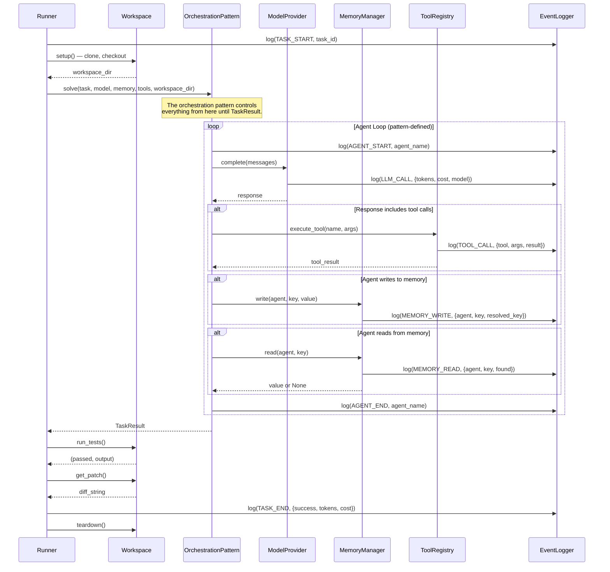

# Experiment Lifecycle — ant-coding

## End-to-End Data Flow

```mermaid
flowchart TD
    subgraph INPUT["📥 Input"]
        CONFIG["experiment.yaml<br/>architecture + model + memory + tasks"]
    end

    subgraph INIT["⚙️ Initialization"]
        LOAD_CONFIG["Load & Validate Config"]
        INIT_MODEL["Init ModelProvider<br/>(via LiteLLM)"]
        INIT_MEM["Init MemoryManager<br/>(shared/isolated/hybrid)"]
        INIT_TOOLS["Init ToolRegistry"]
        INIT_LOGGER["Init EventLogger"]
        LOAD_TASKS["Load Tasks<br/>(SWE-bench/DevBench/YAML)"]
    end

    subgraph EXEC_LOOP["🔄 Execution Loop (per task × runs_per_task)"]
        SETUP_WS["Setup Workspace<br/>Clone repo, checkout commit"]
        
        subgraph ORCHESTRATION["🎭 Orchestration (Plugin)"]
            SOLVE["pattern.solve(task, model, memory, tools)"]
            AGENT_LOOP["Agent Loop<br/>LLM calls → Tool calls → Memory R/W"]
        end
        
        COLLECT["Collect TaskResult<br/>patch, tokens, cost, time"]
        RUN_TESTS["Run Tests<br/>workspace.run_tests()"]
        GET_PATCH["Extract Patch<br/>workspace.get_patch()"]
        TEARDOWN["Teardown Workspace"]
    end

    subgraph EVAL["📊 Evaluation"]
        CALC_METRICS["Calculate Metrics<br/>pass rate, token efficiency"]
        LLM_JUDGE["LLM-as-Judge<br/>correctness, quality, completeness"]
        PASS_K["Compute pass@k<br/>k=1, k=3, k=5"]
    end

    subgraph OUTPUT["📤 Output"]
        RESULTS_DIR["results/{experiment_id}/"]
        METRICS_JSON["metrics.json"]
        EVENTS_JSONL["events.jsonl"]
        TASK_RESULTS["task_results/*.json"]
        PATCHES["patches/*.patch"]
        MEM_LOGS["memory_logs/*.json"]
        REPORT_MD["report.md"]
    end

    CONFIG --> LOAD_CONFIG
    LOAD_CONFIG --> INIT_MODEL
    LOAD_CONFIG --> INIT_MEM
    LOAD_CONFIG --> INIT_TOOLS
    LOAD_CONFIG --> INIT_LOGGER
    LOAD_CONFIG --> LOAD_TASKS

    LOAD_TASKS --> SETUP_WS
    SETUP_WS --> SOLVE
    SOLVE --> AGENT_LOOP
    AGENT_LOOP --> COLLECT
    COLLECT --> RUN_TESTS
    COLLECT --> GET_PATCH
    RUN_TESTS --> TEARDOWN
    GET_PATCH --> TEARDOWN

    TEARDOWN --> CALC_METRICS
    CALC_METRICS --> LLM_JUDGE
    LLM_JUDGE --> PASS_K

    PASS_K --> METRICS_JSON
    PASS_K --> EVENTS_JSONL
    PASS_K --> TASK_RESULTS
    PASS_K --> PATCHES
    PASS_K --> MEM_LOGS
    PASS_K --> REPORT_MD

    METRICS_JSON --> RESULTS_DIR
    EVENTS_JSONL --> RESULTS_DIR
    TASK_RESULTS --> RESULTS_DIR
    PATCHES --> RESULTS_DIR
    MEM_LOGS --> RESULTS_DIR
    REPORT_MD --> RESULTS_DIR

    style ORCHESTRATION fill:#1a3a1a,stroke:#4ecca3,stroke-width:3px
    style EVAL fill:#1a1a3a,stroke:#a29bfe,stroke-width:2px
```

## Task Execution Detail

```mermaid
sequenceDiagram
    participant Runner
    participant Workspace
    participant Pattern as OrchestrationPattern
    participant Model as ModelProvider
    participant Memory as MemoryManager
    participant Tools as ToolRegistry
    participant Logger as EventLogger

    Runner->>Logger: log(TASK_START, task_id)
    Runner->>Workspace: setup() — clone, checkout
    Workspace-->>Runner: workspace_dir

    Runner->>Pattern: solve(task, model, memory, tools, workspace_dir)
    
    Note over Pattern: The orchestration pattern controls<br/>everything from here until TaskResult.

    loop Agent Loop (pattern-defined)
        Pattern->>Logger: log(AGENT_START, agent_name)
        Pattern->>Model: complete(messages)
        Model->>Logger: log(LLM_CALL, {tokens, cost, model})
        Model-->>Pattern: response

        alt Response includes tool calls
            Pattern->>Tools: execute_tool(name, args)
            Tools->>Logger: log(TOOL_CALL, {tool, args, result})
            Tools-->>Pattern: tool_result
        end

        alt Agent writes to memory
            Pattern->>Memory: write(agent, key, value)
            Memory->>Logger: log(MEMORY_WRITE, {agent, key, resolved_key})
        end

        alt Agent reads from memory
            Pattern->>Memory: read(agent, key)
            Memory->>Logger: log(MEMORY_READ, {agent, key, found})
            Memory-->>Pattern: value or None
        end

        Pattern->>Logger: log(AGENT_END, agent_name)
    end

    Pattern-->>Runner: TaskResult

    Runner->>Workspace: run_tests()
    Workspace-->>Runner: (passed, output)
    Runner->>Workspace: get_patch()
    Workspace-->>Runner: diff_string
    Runner->>Logger: log(TASK_END, {success, tokens, cost})
    Runner->>Workspace: teardown()
```

## Cross-Experiment Comparison Flow

```mermaid
flowchart LR
    subgraph EXP_A["Experiment A<br/>Sequential + Shared + Claude"]
        RA["results/exp-a/metrics.json"]
    end

    subgraph EXP_B["Experiment B<br/>Sequential + Isolated + Claude"]
        RB["results/exp-b/metrics.json"]
    end

    subgraph EXP_C["Experiment C<br/>Sequential + Shared + GPT-4o"]
        RC["results/exp-c/metrics.json"]
    end

    COMPARE["scripts/compare_results.py"]

    RA --> COMPARE
    RB --> COMPARE
    RC --> COMPARE

    COMPARE --> STAT["Statistical Tests<br/>t-test, Mann-Whitney, Bootstrap"]
    STAT --> REPORT["comparison_report.md<br/>Tables + p-values + recommendations"]

    style COMPARE fill:#1a1a3a,stroke:#a29bfe
```
