# Git Workflow & Development Process — ant-coding

## Branching Strategy

```mermaid
gitGraph
    commit id: "init"
    branch dev
    checkout dev
    commit id: "project setup"
    
    branch feature/S1-E1-S01
    checkout feature/S1-E1-S01
    commit id: "feat(scaffold): pyproject.toml"
    commit id: "feat(scaffold): directory structure"
    commit id: "docs: BRANCH_SUMMARY.md"
    checkout dev
    merge feature/S1-E1-S01 id: "merge S1-E1-S01"
    
    branch feature/S1-E1-S02
    checkout feature/S1-E1-S02
    commit id: "feat(config): yaml loader"
    commit id: "feat(config): pydantic models"
    commit id: "test(config): validation tests"
    commit id: "docs: BRANCH_SUMMARY.md "
    checkout dev
    merge feature/S1-E1-S02 id: "merge S1-E1-S02"
    
    branch feature/S1-E2-S01
    checkout feature/S1-E2-S01
    commit id: "feat(types): Task dataclass"
    commit id: "feat(types): TaskResult dataclass"
    commit id: "docs: BRANCH_SUMMARY.md  "
    checkout dev
    merge feature/S1-E2-S01 id: "merge S1-E2-S01"

    checkout main
    merge dev id: "🧑 Human reviews & merges" type: HIGHLIGHT
```



## Branch Naming Convention

```
feature/{Sprint}-{Epic}-{Story}
```

Examples:
- `feature/S1-E1-S01` — Sprint 1, Epic 1, Story 01
- `feature/S3-E2-S03` — Sprint 3, Epic 2, Story 03

## Story Lifecycle

```mermaid
flowchart TD
    START["Story Status: not-started"] --> BRANCH["Agent creates branch<br/>feature/SX-EY-SZZ from dev"]
    BRANCH --> WIP["Status: in-progress<br/>Agent updates sprint.yml"]
    
    WIP --> CODE["Agent codes with<br/>atomic conventional commits"]
    CODE --> SELF_TEST["Agent runs tests<br/>pytest + lint"]
    
    SELF_TEST -->|Tests fail| FIX["Agent fixes issues"]
    FIX --> SELF_TEST
    
    SELF_TEST -->|Tests pass| SUMMARY["Agent writes<br/>BRANCH_SUMMARY.md"]
    SUMMARY --> MERGE_DEV["Agent merges branch → dev"]
    MERGE_DEV --> UPDATE["Agent updates sprint.yml<br/>status: done, branch link"]
    
    UPDATE --> NEXT{More stories<br/>in epic?}
    NEXT -->|Yes| NEXT_BRANCH["Branch next story<br/>from latest dev"]
    NEXT_BRANCH --> WIP
    
    NEXT -->|No| EPIC_REVIEW["Agent self-review<br/>of entire epic"]
    EPIC_REVIEW --> EPIC_DONE["Epic status: review<br/>Agent updates sprint.yml"]
    
    EPIC_DONE --> HUMAN["🧑 Human reviews dev branch<br/>Merges dev → main"]

    style HUMAN fill:#3a3a1a,stroke:#ffd460,stroke-width:3px
    style EPIC_REVIEW fill:#1a3a1a,stroke:#4ecca3,stroke-width:2px
```



## Commit Convention

All commits follow [Conventional Commits](https://www.conventionalcommits.org/):

```
<type>(<scope>): <description>

[optional body]
```

| Type | When |
|------|------|
| `feat` | New feature or functionality |
| `fix` | Bug fix |
| `test` | Adding or updating tests |
| `refactor` | Code restructuring (no behavior change) |
| `docs` | Documentation only |
| `chore` | Build, deps, tooling changes |

**Scope** = the layer or module being changed: `config`, `models`, `memory`, `tools`, `orchestration`, `eval`, `observability`, `runner`, `scaffold`

Examples:
```
feat(memory): add MemoryManager with shared mode routing
test(memory): add cross-agent visibility test for shared mode
fix(models): handle LiteLLM timeout with exponential backoff
refactor(tools): extract sandbox config from CodeExecutor
docs(architecture): update memory-architecture.md with hybrid flow
```

## BRANCH_SUMMARY.md Template

Created by the agent in the branch root before merging to dev:

```markdown
# Branch Summary: feature/S1-E2-S01

## Story
S1-E2-S01: Implement MemoryManager base with mode enum

## What Changed
- Added `src/ant_coding/memory/manager.py` with MemoryManager class
- Added `src/ant_coding/memory/__init__.py` with public exports
- Added `configs/memory/shared.yaml` example config

## Key Decisions
- Used dict for state storage (not ADK SessionService yet) to keep
  initial implementation simple. ADK integration is Sprint 4.
- Access log stores value_size instead of value to avoid memory bloat.

## Files Touched
- `src/ant_coding/memory/manager.py` (new)
- `src/ant_coding/memory/__init__.py` (new)
- `configs/memory/shared.yaml` (new)

## How to Verify
```bash
python -m pytest tests/test_memory.py -v
```

## Tokens / Complexity
- Story points: 3
- Files added: 3
- Files modified: 0
- Test coverage: 95%
```

## Zoom Levels for Human Review

```mermaid
graph TD
    subgraph ZOOM_OUT["🔭 Zoom Out: Sprint Progress"]
        SPRINT["sprint.yml<br/>Which epics/stories are done?"]
    end

    subgraph ZOOM_IN["🔍 Zoom In: Story Detail"]
        BRANCH_SUM["BRANCH_SUMMARY.md<br/>What changed and why?"]
    end

    subgraph MICROSCOPE["🔬 Microscope: Exact Steps"]
        GIT_LOG["git log feature/S1-E2-S01<br/>Commit-by-commit coding process"]
    end

    SPRINT --> BRANCH_SUM
    BRANCH_SUM --> GIT_LOG

    style ZOOM_OUT fill:#1a1a3a,stroke:#a29bfe
    style ZOOM_IN fill:#1a3a1a,stroke:#4ecca3
    style MICROSCOPE fill:#3a1a1a,stroke:#ff6b6b
```


