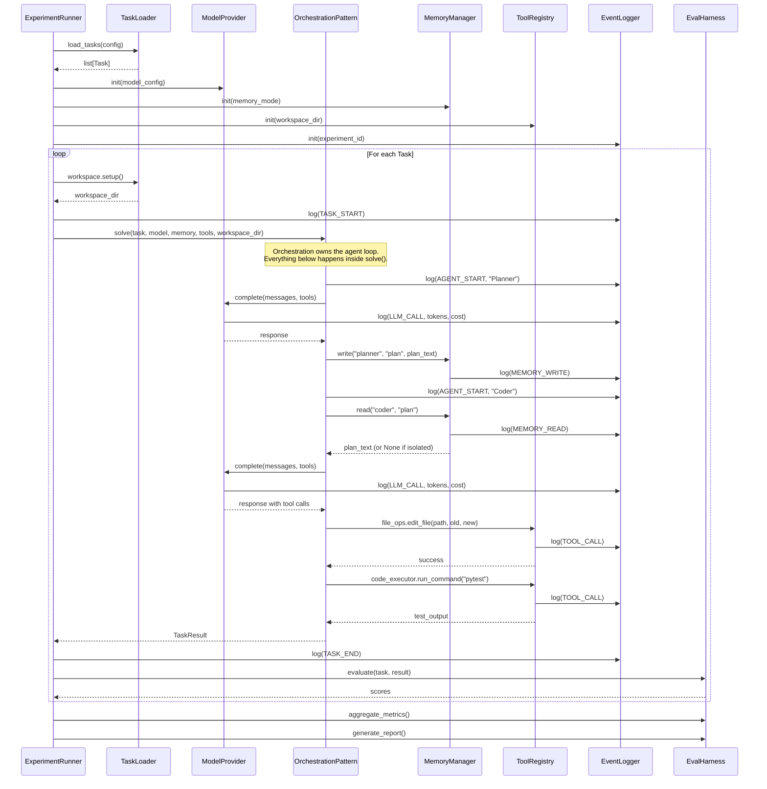
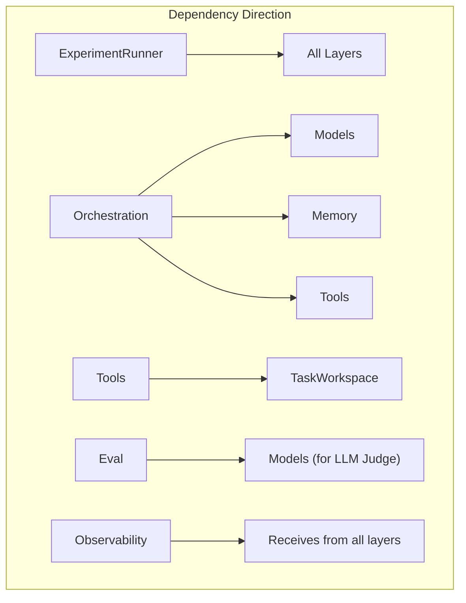

# Layer Interactions — ant-coding

## How Layers Communicate

## Dependency Matrix

Which layer calls which. Read as "Row calls Column".

| Caller ↓ / Callee → | Tasks | Models | Orchestration | Memory | Tools | Eval | Observability |
|----------------------|-------|--------|---------------|--------|-------|------|---------------|
| **ExperimentRunner** | ✅ | ✅ | ✅ | ✅ | ✅ | ✅ | ✅ |
| **Orchestration** | — | ✅ | — | ✅ | ✅ | — | ✅ |
| **Eval** | ✅ | ✅ | — | — | — | — | — |
| **Tools** | ✅* | — | — | — | — | — | ✅ |
| **Memory** | — | — | — | — | — | — | ✅ |

*Tools depend on TaskWorkspace for filesystem scoping.

## Key Design Rule

**Orchestration never imports from Eval, and Eval never imports from Orchestration.** The ExperimentRunner is the only component that sees both. This ensures orchestration patterns can't game the evaluation.
