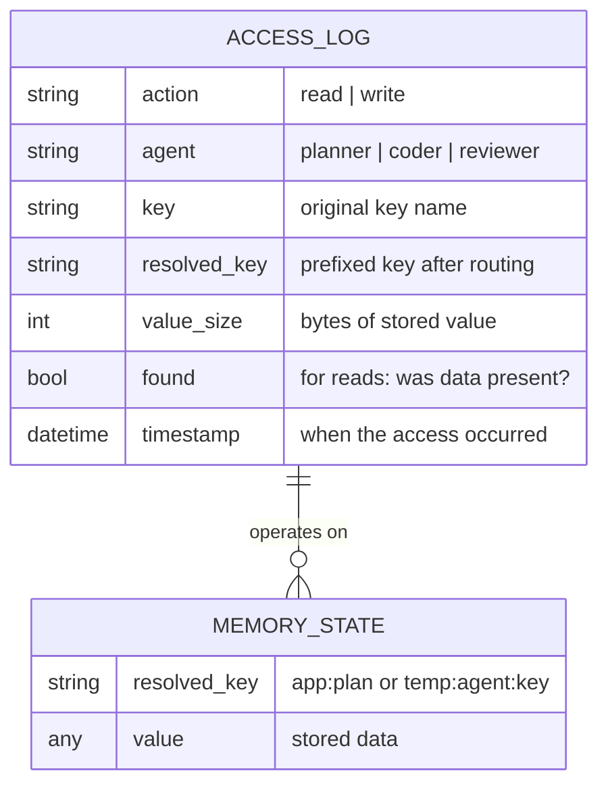

# Memory Architecture — ant-coding

## Core Concept

Memory mode is the **primary independent variable** in ant-coding's research. The MemoryManager routes all agent state reads/writes through a key-resolution layer that enforces access patterns.

## Memory Modes

```mermaid
graph TB
    subgraph SHARED["Shared Memory Mode"]
        direction TB
        PA[Planner Agent] -->|"write('plan', data)"| SK1["app:plan"]
        CA[Coder Agent] -->|"read('plan')"| SK1
        RA[Reviewer Agent] -->|"read('plan')"| SK1
        PA -->|"write('context', data)"| SK2["app:context"]
        CA -->|"read('context')"| SK2
        
        style SK1 fill:#2d5a2d,stroke:#4ecca3
        style SK2 fill:#2d5a2d,stroke:#4ecca3
    end

    subgraph ISOLATED["Isolated Memory Mode"]
        direction TB
        PB[Planner Agent] -->|"write('plan', data)"| IK1["temp:planner:plan"]
        CB[Coder Agent] -->|"read('plan')"| IK2["temp:coder:plan"]
        RB[Reviewer Agent] -->|"read('plan')"| IK3["temp:reviewer:plan"]
        
        IK2 -.->|"Returns None ❌"| CB
        IK3 -.->|"Returns None ❌"| RB
        
        style IK1 fill:#5a2d2d,stroke:#ff6b6b
        style IK2 fill:#5a2d2d,stroke:#ff6b6b
        style IK3 fill:#5a2d2d,stroke:#ff6b6b
    end

    subgraph HYBRID["Hybrid Memory Mode"]
        direction TB
        PC[Planner Agent] -->|"write('plan', data)"| HK1["app:plan ✅ shared"]
        CC[Coder Agent] -->|"read('plan')"| HK1
        PC -->|"write('scratch', data)"| HK2["temp:planner:scratch 🔒 private"]
        CC -->|"read('scratch')"| HK3["temp:coder:scratch 🔒"]
        HK3 -.->|"Returns None ❌"| CC
        
        style HK1 fill:#2d5a2d,stroke:#4ecca3
        style HK2 fill:#5a2d2d,stroke:#ff6b6b
        style HK3 fill:#5a2d2d,stroke:#ff6b6b
    end
```

## Key Resolution Logic

```mermaid
flowchart TD
    START["memory.write(agent, key, value)<br/>or memory.read(agent, key)"] --> MODE{Memory Mode?}
    
    MODE -->|SHARED| SHARED_R["resolved_key = app:{key}"]
    MODE -->|ISOLATED| ISO_R["resolved_key = temp:{agent}:{key}"]
    MODE -->|HYBRID| HYB_CHECK{key in<br/>shared_keys?}
    
    HYB_CHECK -->|Yes| HYB_SHARED["resolved_key = app:{key}"]
    HYB_CHECK -->|No| HYB_PRIVATE["resolved_key = temp:{agent}:{key}"]
    
    SHARED_R --> STORE["Read/Write to state dict"]
    ISO_R --> STORE
    HYB_SHARED --> STORE
    HYB_PRIVATE --> STORE
    
    STORE --> LOG["Log to AccessLog<br/>{action, agent, key, resolved_key, timestamp}"]

    style START fill:#1a1a3a,stroke:#a29bfe
    style LOG fill:#3a1a1a,stroke:#ff6b6b
```

## Access Log Schema

Every read/write is recorded for post-hoc analysis of information flow patterns.

## Why This Matters for Research

The **same orchestration pattern** with **different memory modes** produces measurably different behavior:

| Scenario | Shared | Isolated |
|----------|--------|----------|
| Planner writes plan, Coder reads plan | Coder gets the plan | Coder gets `None`, must work without plan |
| Reviewer writes feedback, Coder reads feedback | Coder can iterate | Coder never sees feedback |
| Three agents write to "analysis" | Last write wins (conflict) | No conflicts, but no collaboration |
| Token efficiency | Lower (agents share context) | Higher (agents duplicate work) |

The access log lets you trace exactly which reads returned `None` in isolated mode — quantifying the "information gap" between architectures.
