# System Overview — ant-coding

## High-Level Architecture

All 8 layers of the ant-coding framework and their relationships.

```mermaid
graph TB
    subgraph "ant-coding Framework"
        
        subgraph L1["Layer 1: Task Management"]
            SWE[SWE-bench]
            DEV[DevBench]
            CUSTOM[Custom YAML]
            LOADER[TaskLoader]
            WORKSPACE[TaskWorkspace]
            SWE --> LOADER
            DEV --> LOADER
            CUSTOM --> LOADER
            LOADER --> WORKSPACE
        end

        subgraph L2["Layer 2: Model Abstraction"]
            LITELLM[LiteLLM Proxy]
            REGISTRY_M[ModelRegistry]
            PROVIDER[ModelProvider]
            COST[CostTracker]
            REGISTRY_M --> PROVIDER
            PROVIDER --> LITELLM
            PROVIDER --> COST
        end

        subgraph L3["Layer 3: Orchestration — PLUGIN"]
            BASE[OrchestrationPattern ABC]
            REG_O[OrchestrationRegistry]
            SEQ[SequentialAgent]
            PAR[ParallelAgent]
            LOOP[LoopAgent]
            CUSTOM_O[Your Experiments]
            BASE --> SEQ
            BASE --> PAR
            BASE --> LOOP
            BASE --> CUSTOM_O
            REG_O --> BASE
        end

        subgraph L4["Layer 4: Memory"]
            MM[MemoryManager]
            SHARED[Shared Mode<br/>app: prefix]
            ISO[Isolated Mode<br/>temp:agent: prefix]
            HYB[Hybrid Mode<br/>mixed prefixes]
            ALOG[AccessLog]
            MM --> SHARED
            MM --> ISO
            MM --> HYB
            MM --> ALOG
        end

        subgraph L5["Layer 5: Tools"]
            CODE[CodeExecutor]
            FILE[FileOperations]
            GIT[GitOperations]
            SEARCH[CodebaseSearch]
            TREG[ToolRegistry]
            TREG --> CODE
            TREG --> FILE
            TREG --> GIT
            TREG --> SEARCH
        end

        subgraph L6["Layer 6: Protocols"]
            MCP[MCP Server]
            A2A[A2A Agent Cards]
        end

        subgraph L7["Layer 7: Evaluation"]
            HARNESS[EvalHarness]
            METRICS[Metrics Calculator]
            JUDGE[LLM-as-Judge]
            STATS[Statistical Comparison]
            REPORT[ReportGenerator]
            HARNESS --> METRICS
            HARNESS --> JUDGE
            HARNESS --> STATS
            STATS --> REPORT
        end

        subgraph L8["Layer 8: Observability"]
            ELOG[EventLogger]
            REPLAY[SessionReplay]
            LATENCY[LatencyTracker]
            ELOG --> REPLAY
        end
    end

    RUNNER[ExperimentRunner] --> L1
    RUNNER --> L2
    RUNNER --> L3
    RUNNER --> L4
    RUNNER --> L5
    RUNNER --> L7
    RUNNER --> L8

    L3 -->|"calls"| L2
    L3 -->|"reads/writes"| L4
    L3 -->|"uses"| L5
    L5 -->|"exposed via"| L6
    L8 -->|"logs from"| L3
    L8 -->|"logs from"| L4
    L8 -->|"logs from"| L5

    LITELLM -->|"Claude"| CLAUDE[Anthropic API]
    LITELLM -->|"GPT"| OPENAI[OpenAI API]
    LITELLM -->|"Gemini"| GOOGLE[Google API]
    LITELLM -->|"Grok"| XAI[xAI API]
    LITELLM -->|"DeepSeek"| DS[DeepSeek API]

    style L3 fill:#1a3a1a,stroke:#4ecca3,stroke-width:3px
    style L4 fill:#3a1a1a,stroke:#ff6b6b,stroke-width:3px
    style RUNNER fill:#1a1a3a,stroke:#a29bfe,stroke-width:2px
```

## Layer Responsibilities

| Layer | Responsibility | Key Classes | Depends On |
|-------|---------------|-------------|------------|
| 1. Tasks | Load & normalize benchmark tasks | `TaskLoader`, `TaskWorkspace`, `Task` | — |
| 2. Models | Unified LLM access via LiteLLM | `ModelProvider`, `ModelRegistry` | — |
| 3. Orchestration | **PLUGIN** — Define agent architectures | `OrchestrationPattern` (ABC) | Layers 2, 4, 5 |
| 4. Memory | Shared/Isolated/Hybrid state management | `MemoryManager` | — |
| 5. Tools | Code execution, file ops, git, search | `ToolRegistry`, `CodeExecutor` | Layer 1 (workspace) |
| 6. Protocols | MCP + A2A communication standards | `MCPServer`, `A2ACard` | Layer 5 |
| 7. Evaluation | Metrics, LLM judge, statistical comparison | `EvalHarness`, `LLMJudge` | Layers 1, 2 |
| 8. Observability | Event logging, replay, cost tracking | `EventLogger`, `SessionReplay` | All layers |

## Design Principles

1. **Each layer is independently swappable** — Change the model without touching orchestration. Change memory mode without touching tools.
2. **Orchestration is a plugin** — The framework provides everything *around* the orchestration layer. Researchers implement `OrchestrationPattern.solve()`.
3. **Memory mode is configuration** — Switching between shared/isolated/hybrid is a YAML flag change, not a code change.
4. **Everything is observable** — Every LLM call, tool call, and memory access produces an immutable event.
