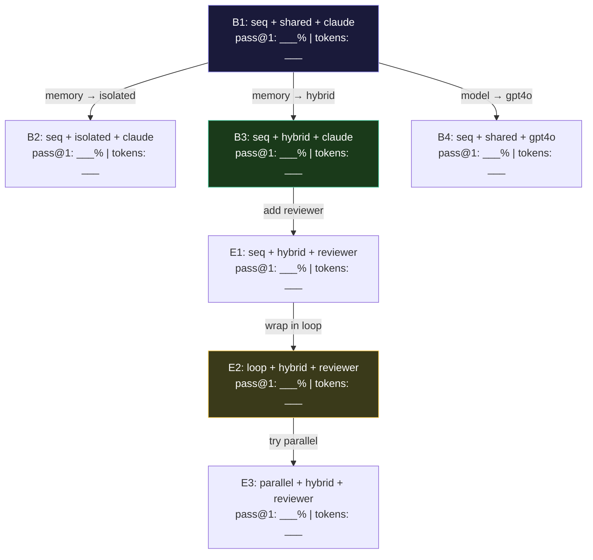

# Experimentation Playbook — ant-coding

## The Problem with Brute Force

With 3 orchestration patterns × 3 memory modes × 5 models × variable agent counts, you have **hundreds** of possible configurations. Running all of them is expensive, slow, and produces a wall of numbers with no narrative.

Instead, use **incremental evolution**: start simple, measure, form a hypothesis, change **one variable**, measure again, repeat. Each experiment builds on the last. You're not searching — you're climbing.

---

## The Method: Experiment Ladders

An experiment ladder is a sequence where each rung changes exactly one variable from the previous rung. This isolates **what caused** any performance change.

```
Rung 1: Baseline                    → Establish ground truth
Rung 2: Change memory mode          → Does shared beat isolated?
Rung 3: Change orchestration        → Does parallel beat sequential?
Rung 4: Change agent count          → Does adding a reviewer help?
Rung 5: Change model                → Is this architecture-dependent or model-dependent?
```

**Golden rule: Never change two things at once.** If you switch from (sequential + shared + Claude) to (parallel + isolated + GPT), you learn nothing — you can't attribute the delta to any single change.

---

## Phase 1: Establish Baselines (Run First)

Before optimizing anything, establish reference points. Run these 4 experiments:

```yaml
# Experiment B1: The absolute minimum
experiment:
  id: "baseline-seq-shared-claude"
  description: "2-agent sequential pipeline, shared memory, Claude Sonnet"
  orchestration: "minimal-sequential"    # Planner → Coder
  memory: { mode: "shared" }
  model: "claude-sonnet"
  tasks: { source: "custom", limit: 10 } # Start with custom tasks, NOT SWE-bench

# Experiment B2: Same architecture, isolated memory
experiment:
  id: "baseline-seq-isolated-claude"
  description: "Same as B1 but isolated memory"
  orchestration: "minimal-sequential"
  memory: { mode: "isolated" }
  model: "claude-sonnet"
  parent: "baseline-seq-shared-claude"   # ← Track lineage
  variable_changed: "memory mode"
  hypothesis: "Isolated memory will use more tokens (coder can't read plan) but may force coder to be more self-sufficient"

# Experiment B3: Same architecture, hybrid memory
experiment:
  id: "baseline-seq-hybrid-claude"
  description: "Same as B1 but hybrid memory (plan shared, scratch private)"
  orchestration: "minimal-sequential"
  memory: { mode: "hybrid", shared_keys: ["implementation_plan"] }
  model: "claude-sonnet"
  parent: "baseline-seq-shared-claude"
  variable_changed: "memory mode"
  hypothesis: "Hybrid gives best of both — shared plan for coordination, private scratch for focused reasoning"

# Experiment B4: Different model, same best architecture
experiment:
  id: "baseline-seq-shared-gpt4o"
  description: "Same as B1 but GPT-4o"
  orchestration: "minimal-sequential"
  memory: { mode: "shared" }
  model: "gpt-4o"
  parent: "baseline-seq-shared-claude"
  variable_changed: "model"
  hypothesis: "Architecture effects are model-independent — if shared beats isolated on Claude, it should on GPT too"
```

**After Phase 1, you know:**
- Does memory mode matter at all? (B1 vs B2 vs B3)
- How big is the effect? (statistical comparison)
- Is the effect model-dependent? (B1 vs B4)
- Your cost-per-experiment (for budgeting Phase 2)

---

## Phase 2: Evolve the Winner (Guided by Data)

Take the best-performing baseline and evolve it. Use the **decision tree** below to decide what to try next.

### Decision Tree: What to Change Next

```
START: Look at your baseline results
│
├─ Pass rate < 30%?
│  → Your agents can't solve the tasks at all
│  → Try: Stronger model, simpler tasks, better system prompts
│  → Do NOT change architecture yet — fix the foundation
│
├─ Pass rate 30-60%?
│  → Architecture has room to improve
│  │
│  ├─ Token usage is high + many failed tasks?
│  │  → Agents are trying hard but failing
│  │  → Try: Add a Reviewer agent (code review loop)
│  │  → Try: LoopAgent pattern (iterate until tests pass)
│  │
│  ├─ Token usage is low + many failed tasks?
│  │  → Agents are giving up too early
│  │  → Try: Increase token budget
│  │  → Try: Add a Debugger agent that analyzes test failures
│  │
│  └─ High variance between runs (pass@1 << pass@3)?
│     → Architecture is unreliable but sometimes works
│     → Try: Add structured planning step
│     → Try: Hybrid memory (share the plan, isolate the scratch)
│
├─ Pass rate 60-80%?
│  → Architecture is solid, optimize efficiency
│  │
│  ├─ Shared memory has MORE tokens than isolated?
│  │  → Agents are over-reading shared state (context bloat)
│  │  → Try: Hybrid with selective sharing
│  │  → Try: Summarize shared state before passing
│  │
│  ├─ Isolated memory has FEWER tokens but LOWER pass rate?
│  │  → Confirms shared memory helps quality at cost of tokens
│  │  → This is a key finding — document it
│  │  → Try: Hybrid to find the sweet spot
│  │
│  └─ ParallelAgent beats SequentialAgent?
│     → Try: Parallel + LoopAgent (parallel draft, then iterative refinement)
│     → Try: Add more parallel agents (3-way instead of 2-way)
│
└─ Pass rate > 80%?
   → Architecture is strong — stress test it
   → Move to SWE-bench Lite (harder, real-world tasks)
   → Try: Reduce token budget (find minimum viable tokens)
   → Try: Cheaper/faster models (Gemini Flash, Haiku)
```

### Experiment Naming Convention

```
{parent_id}--{variable_changed}
```

Examples:
```
baseline-seq-shared-claude
baseline-seq-shared-claude--add-reviewer        (added 3rd agent)
baseline-seq-shared-claude--add-reviewer--loop   (wrapped in loop)
baseline-seq-shared-claude--add-reviewer--loop--hybrid  (changed memory)
```

The name IS the lineage. You can trace any experiment back to its ancestors.

---

## Phase 3: Cross-Cutting Experiments

Once you have a strong architecture, test it across dimensions:

### Model Sensitivity Matrix

Hold architecture constant, vary model:

```
Best Architecture (e.g., 3-agent loop, hybrid memory)
  ├── Claude Sonnet
  ├── GPT-4o
  ├── Gemini Flash
  ├── DeepSeek
  └── Grok
```

**Question answered:** Is your architecture's advantage model-specific or universal?

### Task Difficulty Scaling

Hold architecture + model constant, vary task difficulty:

```
Best Config
  ├── Custom easy tasks (your hand-written ones)
  ├── SWE-bench Lite (curated subset)
  ├── SWE-bench Full (all tasks)
  └── DevBench (full SDLC tasks)
```

**Question answered:** Does the architecture advantage hold as tasks get harder?

### Agent Count Curve

Hold pattern + memory + model constant, vary agent count:

```
Sequential Pipeline
  ├── 2 agents: Planner → Coder
  ├── 3 agents: Planner → Coder → Reviewer
  ├── 4 agents: Planner → Coder → Reviewer → Debugger
  └── 5 agents: Architect → Planner → Coder → Reviewer → Debugger
```

**Question answered:** Where are the diminishing returns? (This is often a curve that peaks at 3-4 agents.)

---

## The Experiment Journal

Every experiment must be recorded. Create a file per experiment in a registry:

### File: `experiments/registry.yml`

```yaml
experiments:
  - id: "baseline-seq-shared-claude"
    date: "2026-02-20"
    parent: null
    variable_changed: null
    hypothesis: "Establish ground truth for 2-agent sequential pipeline"
    config: "configs/experiments/baseline-seq-shared-claude.yaml"
    results: "results/baseline-seq-shared-claude/"
    
    # Fill in AFTER the experiment runs
    outcome:
      pass_rate: null
      avg_tokens: null
      avg_cost: null
      pass_at_1: null
      pass_at_3: null
    
    insight: ""
    next_action: ""
    status: "planned"  # planned → running → complete

  - id: "baseline-seq-isolated-claude"
    date: "2026-02-20"
    parent: "baseline-seq-shared-claude"
    variable_changed: "memory: shared → isolated"
    hypothesis: "Isolated memory forces agents to be self-sufficient, possibly lower quality but fewer tokens"
    config: "configs/experiments/baseline-seq-isolated-claude.yaml"
    results: "results/baseline-seq-isolated-claude/"
    outcome:
      pass_rate: null
      avg_tokens: null
      avg_cost: null
      pass_at_1: null
      pass_at_3: null
    insight: ""
    next_action: ""
    status: "planned"
```

### What to Write After Each Experiment

Fill in three fields:

**`outcome`** — The numbers. Copy from `metrics.json`.

**`insight`** — One sentence. What did you learn that you didn't know before?
- Good: "Shared memory reduces tokens by 23% because the coder doesn't re-derive the plan"
- Good: "Adding a reviewer increased pass rate from 45% to 62% but doubled token cost"
- Bad: "Shared memory is better" (no explanation of why)

**`next_action`** — What experiment should run next, based on this insight?
- Good: "Try hybrid memory with only 'plan' shared — test if selective sharing captures the 23% token savings without full state sharing overhead"
- Bad: "Try more experiments" (no direction)

---

## Reading Results: What to Look For

### The Four Signals

When comparing experiment A vs experiment B:

| Signal | What It Means | Action |
|--------|--------------|--------|
| **Pass rate up, tokens down** | Strictly better architecture. Rare and valuable. | Keep this change. Build on it. |
| **Pass rate up, tokens up** | Better quality at higher cost. Common tradeoff. | Worth it if pass rate gain > token cost gain. Calculate cost-per-successful-task. |
| **Pass rate down, tokens down** | Cheaper but worse. Agents doing less work. | Only useful if you're optimizing for cost on easy tasks. |
| **Pass rate same, tokens different** | Architectures equivalent on quality. | Pick the cheaper one. The "improvement" didn't help. |

### The Key Metric: Cost Per Successful Task

> For the full metrics framework (11 metrics across 4 tiers), see `docs/spec/success-metrics.md`

```
cost_per_success = total_cost / tasks_passed
```

This is the single number that captures the quality-efficiency tradeoff. An architecture that costs $2/task but passes 80% ($2.50/success) beats one that costs $1/task but passes 30% ($3.33/success).

### Watch for These Traps

| Trap | How to Detect | What to Do |
|------|--------------|------------|
| **Overfitting to custom tasks** | High pass rate on custom tasks, low on SWE-bench | Test on SWE-bench earlier |
| **Hallucination cascades** | Agent A hallucinates, Agent B builds on it, Agent C validates it | Check event logs for error propagation patterns |
| **Context bloat in shared memory** | Token count increases linearly with agent count | Try hybrid memory or state summarization |
| **Review loops that never converge** | LoopAgent hits max iterations every time | Add clearer termination criteria or cap at 3 iterations |
| **Model-specific results** | Architecture X beats Y on Claude but loses on GPT | Your finding is about model-architecture interaction, not architecture alone |

---

## Experiment Cadence

Recommended rhythm:

```
Week 1: Phase 1 baselines (4 experiments)
         → Analyze results, form first hypotheses

Week 2: Phase 2 evolution (3-5 experiments)
         → Change one variable per experiment
         → Kill dead-end branches early

Week 3: Phase 2 continued (3-5 experiments)
         → Deep dive on most promising architecture
         → Start adding agent roles (reviewer, debugger)

Week 4: Phase 3 cross-cutting (5-8 experiments)
         → Model sensitivity, task scaling, agent count curve
         → Produce final comparison report
```

Total: ~20 experiments over 4 weeks. Not 200.

---

## Evolution Diagram Template

Track your experiment tree visually. Update this as you go:



The green node is your current best. The yellow node is what you're testing. Dead ends stay gray.

---

## Checklist Before Running Any Experiment

- [ ] Parent experiment is identified (or null for baselines)
- [ ] Exactly ONE variable changed from parent
- [ ] Hypothesis written BEFORE running (no post-hoc rationalization)
- [ ] Config YAML created and validated
- [ ] Same tasks as parent experiment (for fair comparison)
- [ ] Same number of runs_per_task (for pass@k consistency)
- [ ] Entry added to `experiments/registry.yml` with status: "planned"
